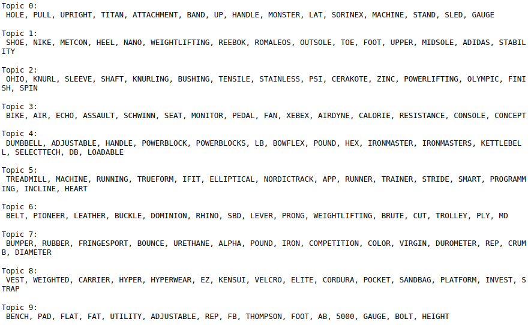

## Garage Gym Reviews Recommender System

The purpose of this project is to create a recommender system for the [Garage Gym Reviews](https://www.garagegymreviews.com) website. Currently, the model contains 430 blog posts and has been paired down to 5,984 unique words. For initial analysis 10 topic have been constructed from the corpus using the Non-Negative Matrix Factorization. 

**Topic Analysis:**

**Topic 0:** Rack and rack accessories

**Topic 1:** Weightlifting shoes

**Topic 2:** Barbells

**Topic 3:** Cardio bikes

**Topic 4:** Adjustable dumbbells

**Topic 5:** Cardio machines

**Topic 6:** Weightlifting belts/ belt squat machine

**Topic 7:** Weight plates

**Topic 8:** Loadable weight vests

**Topic 9:** Weight benches

Additionally with the topic analysis, a content based filtering recommendation system has been constructed using the pairwise distance method with a cosine similarity distance metric. More work needs to be done to retrieve the article titles from the raw html to make the recommendation system more meaningful. Currently, the output is an array of documents that are similar to the document in question, but the titles are the numerical row indices of those documents. 
